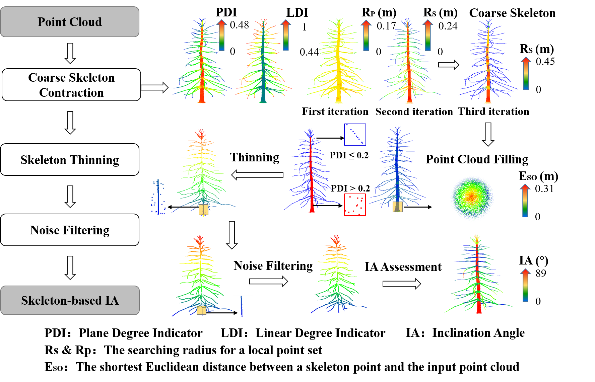
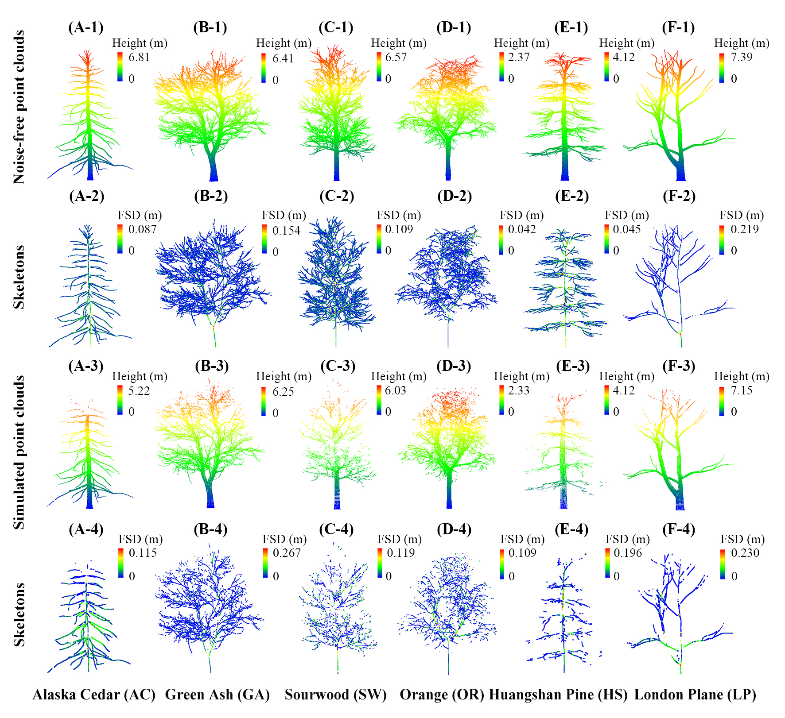

# WoodSKE
**An algorithm to extract skeletons from discrete point clouds of tree branches collected by terrestrial laser scanners.** 
     We developed the WoodSKE method to extract `skeletons` from discrete point clouds of tree branches collected by `terrestrial laser scanners (TLSs).` A TLS point cloud of tree branches is firstly contracted according to the pointwise local point distribution pattern to extract its `coarse skeleton.` Then, the coarse skeleton is thinned and optimized by a noise-filtering method. 
--
**DOI**:
https://linkinghub.elsevier.com/retrieve/pii/S0303243421002968 
**Reference:** Wu B, Zheng G, Chen Y, et al. Assessing inclination angles of tree branches from terrestrial laser scan data using a skeleton extraction method[J]. International Journal of Applied Earth Observation and Geoinformation, 2021, 104: 102589. 
**Graphical Abstract:**  

**Highlights:**  
The WoodSKE method is suitable for extracting skeletons from woody point clouds with variable point density and outliers at `the single-tree and plot scales.` Setting seed points or converting the format of discrete point clouds is `not required` when using the WoodSKE method. Besides, the WoodSKE-extracted skeletons maintained the structure of twigs, which provided a base for extracting their inclination angles and other geometrical features. Before running the WoodSKE method, users `do not need to segment individual trees or single branches` from tree point clouds.  
**Results show:**  

