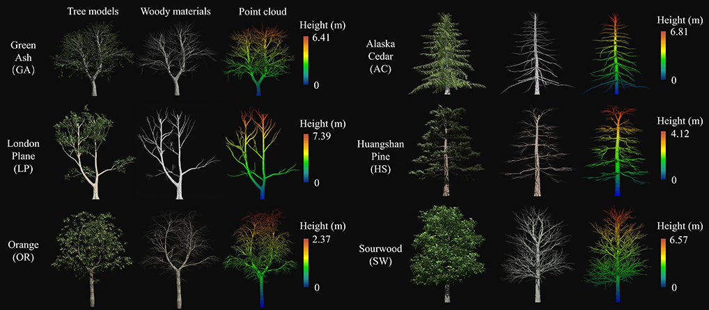

# WoodSKE
**An algorithm to extract skeletons from discrete point clouds of tree branches collected by terrestrial laser scanners.** 

We developed the WoodSKE method to extract `skeletons` from discrete point clouds of tree branches collected by `terrestrial laser scanners (TLSs).` A TLS point cloud of tree branches is firstly contracted according to the pointwise local point distribution pattern to extract its `coarse skeleton.` Then, the coarse skeleton is thinned and optimized by a noise-filtering method. 

**DOI**:
https://linkinghub.elsevier.com/retrieve/pii/S0303243421002968  
**Reference:** Wu B, Zheng G, Chen Y, et al. Assessing inclination angles of tree branches from terrestrial laser scan data using a skeleton extraction method[J]. International Journal of Applied Earth Observation and Geoinformation, 2021, 104: 102589.  

**Graphical Abstract:**  

**Highlights:**   
The WoodSKE method is suitable for extracting skeletons from woody point clouds with variable point density and outliers at `the single-tree and plot scales.` Setting seed points or converting the format of discrete point clouds is `not required` when using the WoodSKE method. Besides, the WoodSKE-extracted skeletons maintained the structure of twigs, which provided a base for extracting their inclination angles and other geometrical features. Before running the WoodSKE method, users `do not need to segment individual trees or single branches` from tree point clouds.  

We share the Python script of WoodSKE in the `Script` folder and the test datasets (TLS point clouds at single-tree and plot scales) in .csv format in the `TestData` folder.  <be>

**Required Packages:**  
Numpy  https://numpy.org/install/  
Scipy  https://scipy.org/install/  

**Test Datasets:**  
  
**Results show:**  

The key steps of WoodSKE are `Coarse skeleton contraction` and `Skeleton thinning`.<be> The detailed description of these two steps is provided in the related paper. The thinning step of the post-filling coarse skeleton analyzed during the coarse skeleton contraction is shown in the following figure: 

The points in the blue spherical area formed the nearby point set (SCO) of a coarse skeleton point PCS (green dot). ESO means the nearest Euclidean distance between PCS and the input point cloud (the distance between PCS and Pnear). PL is the farthest point to Pnear (blue dot) in the SCO. The ESO of PL (orange dot) is ESO ′. In the inset (C), the skeleton point PSKE (red dot) was located by the mean coordinate of points with larger ESO than that of PCS in the dash-shaded area. The red lines present the thinned skeleton.  

The SKE-assessed inclination angles (IAs) of provided woody point clouds.  

**In the folder `script (in Python) `, `WoodSKE.py ` is used to extract the skeleton of woody point clouds, while `ANGLE-CALCULAT.py ` is used to extract the inclination angles of single branches based on the woody point clouds and WoodSKE-extracted skeletons.** 

**Hope that the WoodSKE algorithm can be helpful in your research project. If you have any issues, do not hesitate to contact me via email (wbx19911026@outlook.com) or leave a message under this project.**  
**Please note that the results obtained by the WoodSKE algorithm still require optimization for the skeleton continuity.**  

**Acknowledgments**  
We sincerely thank providers of the TR dataset (https://doi.org/10.1111/2041-210x.12933) and developers of   the LeWoS (https://doi.org/10.1111/2041-210X.13342),   Laplacian contraction (https://doi.org/10.1109/SMI.2010.25, https://doi.org/10.1016/j.agrformet.2019.107874),   L1-medial ( https://doi.org/10.1145/2461912.2461913),   CloudCompare (www.cloudcompare.org),   HELIOS ++ (https://www.sciencedirect.com/science/article/pii/S0034425721004922),    and Starlab software (https://github.com/OpenGP/starlab).    *We also thank our colleague Zengxin Yun for helping us compile the HELIOS ++ software.

